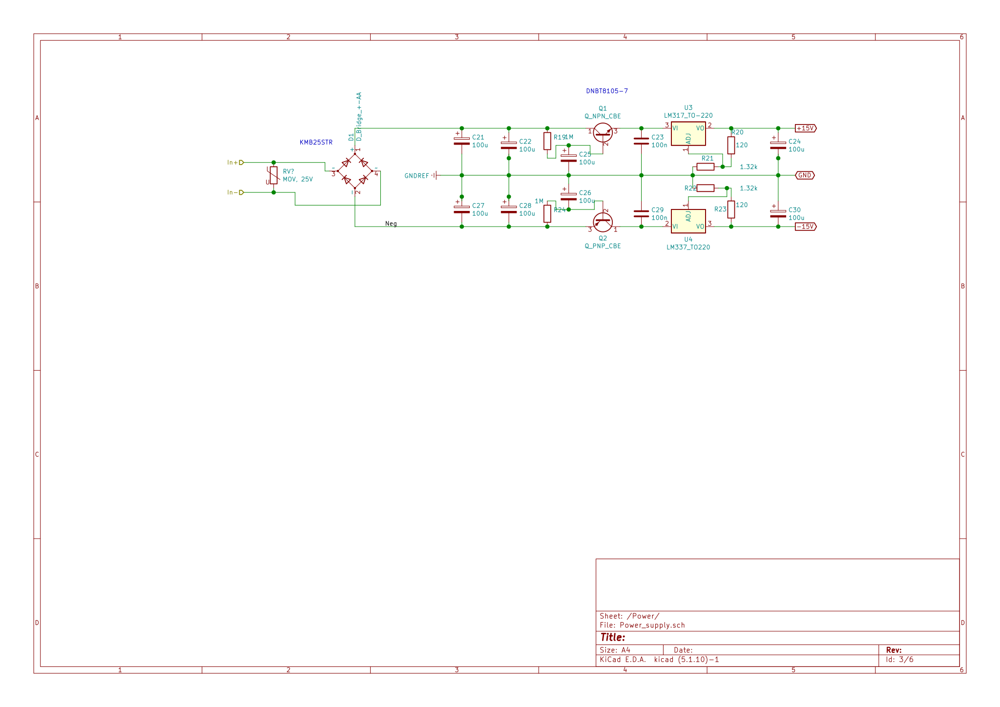

# Audio-Preamp
This is an analog audio preamplifier, designed on first principles as well as help from Small Signal Audio Design by Douglas Self, as well as applications notes from Rod Elliott. 

## Schematic
the schematic is listed in the project files, in many parts. [the pdf schematic is linked here](Audio_Preamp.pdf)

## Power Supply Design
The design for the power supply relies on an INput AC plug pack, anywhere between 12-25V input.

it is designed with some input protection from transient spikes of wall voltage, if the plug pack is poorly designed by a MOV. Effectively it is a half wave rectifier for each rail, and a virtual ground point.  Otherwise it is a fairly standard linear power supply, except that to reduce cost and part count, a input capacitance is obtained through a capacitance multiplier. the only disadvantage is that it cannot help source higher currents, but that is not needed on a preamplifier as well as being mitigated by a high output capacitance. 
