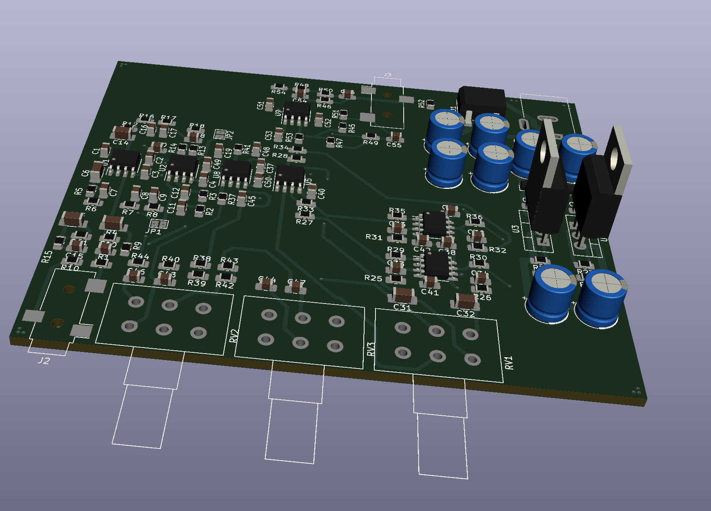

# Audio-Preamp
This is an analog audio preamplifier, designed on first principles as well as help from Small Signal Audio Design by Douglas Self, as well as applications notes from Rod Elliott. 

## Schematic
the schematic is listed in the project files, in many parts. [the pdf schematic is linked here](Audio_Preamp.pdf)

## Power Supply Design
The design for the power supply relies on an INput AC plug pack, anywhere between 12-25V input.

it is designed with some input protection from transient spikes of wall voltage, if the plug pack is poorly designed by a MOV. Effectively it is a half wave rectifier for each rail, and a virtual ground point.  Otherwise it is a fairly standard linear power supply, except that to reduce cost and part count, a input capacitance is obtained through a capacitance multiplier. the only disadvantage is that it cannot help source higher currents, but that is not needed on a preamplifier as well as being mitigated by a high output capacitance. 

## Other Design elements

The rest of the design is fairly lengthy, and involves several larger elements taken from basic principles. The input is a standard RCA audio jack, as it is an easier connection and has better noise characteristics than a balanced input. the controls follow with a baxendall tonal control, and then a baxendall volume control. All of this is designed to be very low noise (-90DB) and high fidelity all analog preamp. 

## Hardware layout

This board needed to be relatively space efficient, and total space is one factor which influences cost of production. so this is designed as a 50x80 mm  4 layer board, which should make a favorable production cost. as this is fiarly small and lower power another cost saver is it only needs 1 oz copper, not 2 oz copper. Another point for production is that almost all components are SMD, thus decreases cost of assembly. 

overall mockup:

## version 2
This version has RCA out, but V2 may have balanced output as well as active crossovers. 
